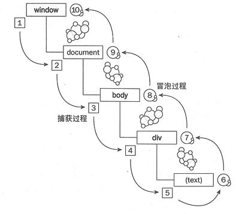

DOM 即 文档对象模型。

### Dom事件

#### Dom0事件
  在js中html元素都有一个对应的对象，这个对象的属性对应那个html元素的性质，所以可以用js代码添加事件监听函数
  document.getElementById("myButton").onclick = function () {
        alert('thanks');
}

#### Dom1事件
主要定义的是HTML和XML文档的底层结构

####  Dom2事件
  Dom2事件为事件吹里程序的赋值和移除定义了两个方法：addEventListener()和removeEventListener(),把这两个方法暴露在所有的dom节点上

Document.addEventListener(type,listener,{option},useCapture)
Type：表示监听事件类型的字符串  
Listener:实现eventListener接口的函数   
Option:【可选】     
  capture:[boolean],表示listener会在该类型的事件捕获阶段传播到该EventTarget时触发(在捕获阶段触发)
  once:[boolean],表示listener在添加之后最多只调用一次，如果是true，listener会在其被调用之后自动移除。

####  Dom3事件
  主要是添加了一些新的事件
      UI事件，当用户与页面上的元素交互时触发，如：load、scroll
      焦点事件，当元素获得或失去焦点时触发，如：blur、focus
      鼠标事件，当用户通过鼠标在页面执行操作时触发如：dbclick、mouseup
      滚轮事件，当使用鼠标滚轮或类似设备时触发，如：mousewheel
      文本事件，当在文档中输入文本时触发，如：textInput
      键盘事件，当用户通过键盘在页面上执行操作时触发，如：keydown、keypress
      合成事件，当为IME（输入法编辑器）输入字符时触发，如：compositionstart
      变动事件，当底层DOM结构发生变化时触发，如：DOMsubtreeModified

Dom事件流包含三个阶段，（捕获阶段，目标阶段和冒泡阶段）
首先发生的事件是捕获为截获事件提供机会，然后是实际接受事件，最后一个阶段是事件的冒泡阶段。在这给阶段对事件作出响应

如图
捕获阶段：事件从document节点自上而下向目标节点传播的阶段（1-5）
目标阶段：真正的目标节点正在处理的事件的阶段（5-6）
冒泡阶段：事件从目标节点自上而下向document节点传播的阶段（6-10）

目标元素的事件在目标阶段执行，其他事件会在冒泡阶段执行。每个事件只会执行一次

| 事件 | 是否可以冒泡 | 
| ------ | ------ | 
| click | √ | 
| dbclick | √ | 
| keydown | √ | 
| keyup | √ | 
| mousedown | √ | 
| mousemove | √ | 
| mouseout | √ | 
| mouseover | √ | 
| mouseup | √ | 
| keyup | √ | 
| scroll | √ | 
| focus | √ | 
| load | √ | 
| mouseenter | √ | 
| mouseleave | √ | 
| resize | √ | 
| unload | √ | 
